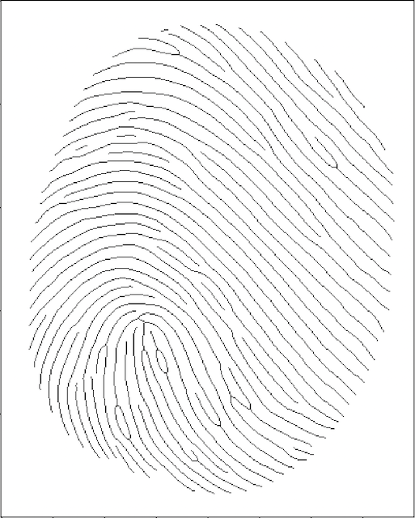
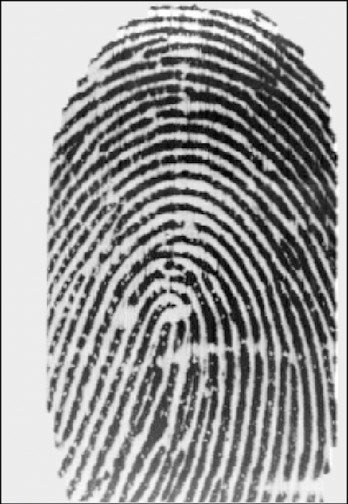
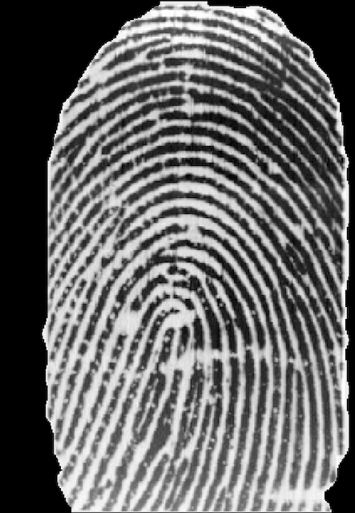
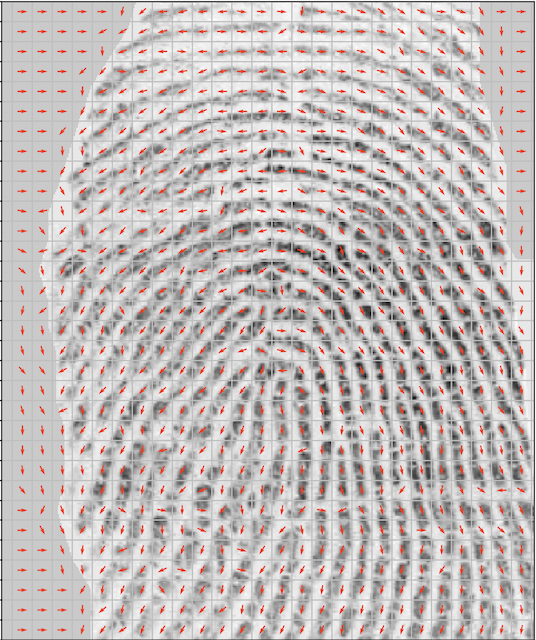
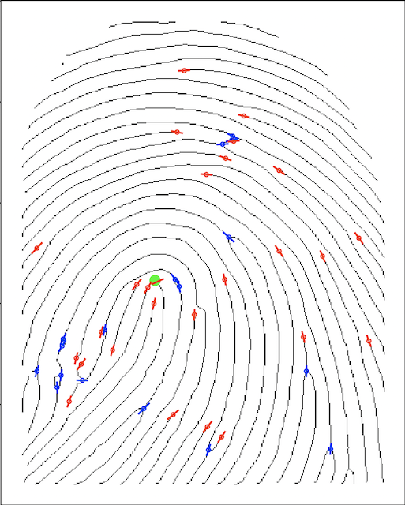

# PyFnPrint

Simple fingerprint recognition library written in Python3. The library implements various fingerprint preprocessing and recognition methods along with evaluation and database splitting utilities

# Structure

## [fplib](fplib)

- The library sources containing the following modules:
    - [image.py](fplib/image.py) - a wrapper for a fingerprint image with a filename like "${id}_${number}.${ext}" and lazy file reading
    - [preprocess.py](fplib/preprocess.py) - preprocessing module containing various image quality enhancing functions and functions for extraction of ridge characteristics
    - [binarize.py](fplib/binarize.py) - binarization module wrapping various opencv calls
    - [filter.py](fplib/filter.py) - filtering module supporting custom kernels and gabor filtering
    - [minutae.py](fplib/minutae.py) - minutae points extraction and preprocessing module supporting core point detection
    - [feature.py](fplib/feature.py) - feature extraction and comparison module
    - [plot.py](fplib/plot.py) - plotting module for various stages of preprocessing

## [db/PNG](db/PNG)

- Database containing 128 high quality fingerprint images 8 for each user
- More challenging are databases used by the FVC competition

## [dbsplit.py](dbsplit.py)

- Command line tool for splitting any amount of fingerprint images into a single filesystem database with train/test structure. Generates test.csv file which can be used for remote evaluation of predictions

## [evaluation.py](evaluation.py)

- Command line tool for evaluating predictions

## [example.py](example.py)

- Example program that uses fplib sources to create a fingerprint identification model

<!-- 

Some images of processed fingerprints
 -->

Original image         | Skeletonized
:---------------------:|:------------------------------:
   | 
**Original image**     | **Segmented**
   | 
**Ridge orientations** | **Minutae**
 | 

<!-- 
 -->

# Prerequisites:

- Python3 interpreter
- Dependencies: numpy, opencv2, skimage, matplotlib, pandas, seaborn
